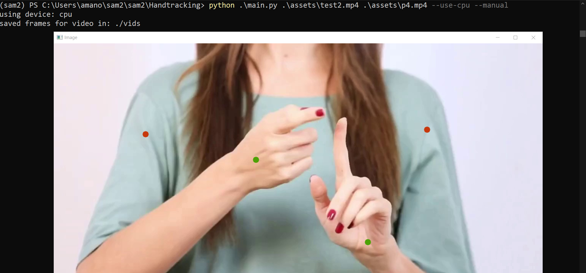
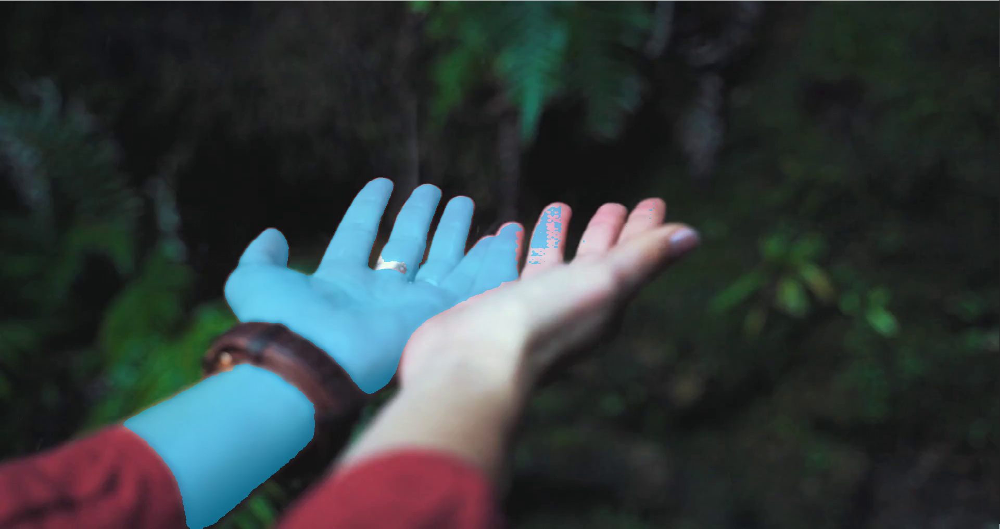
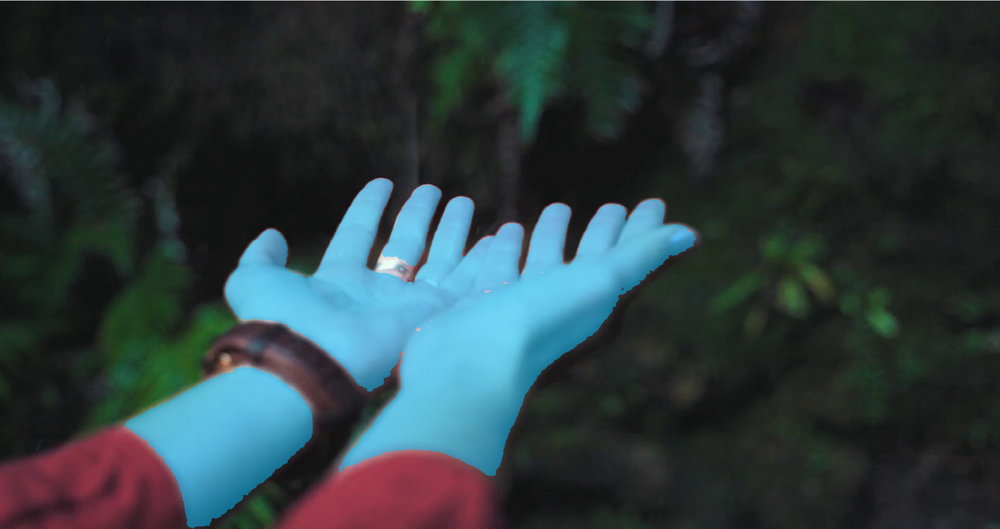
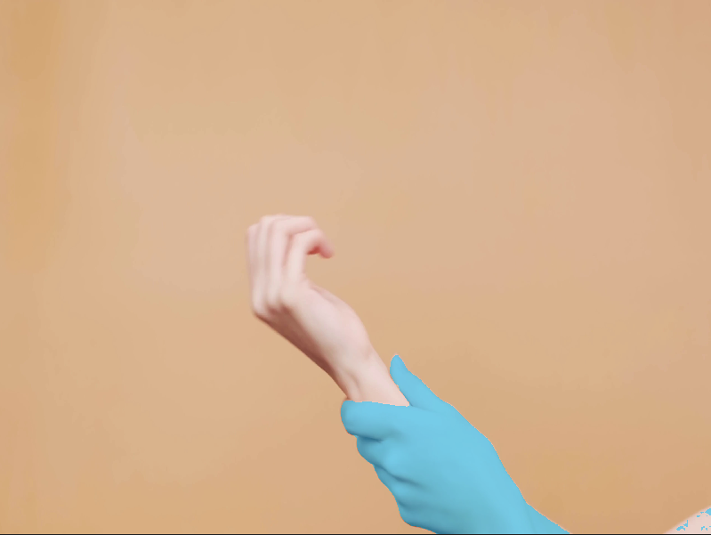
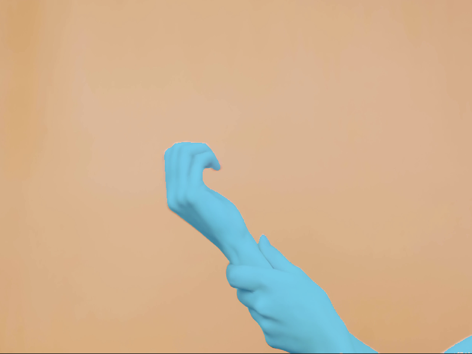
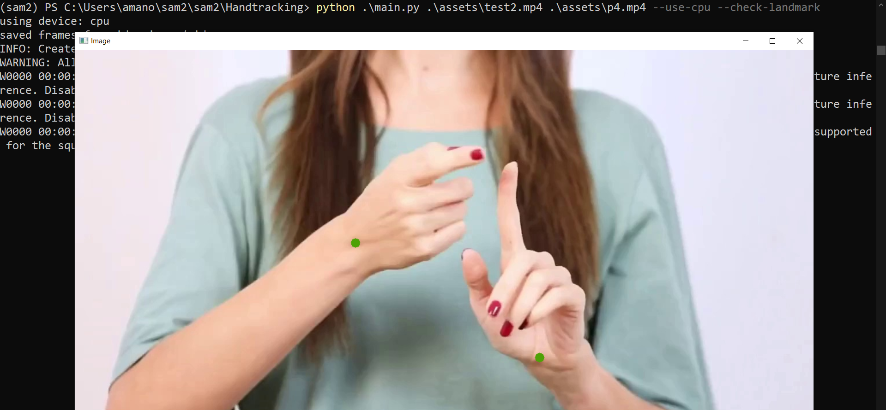
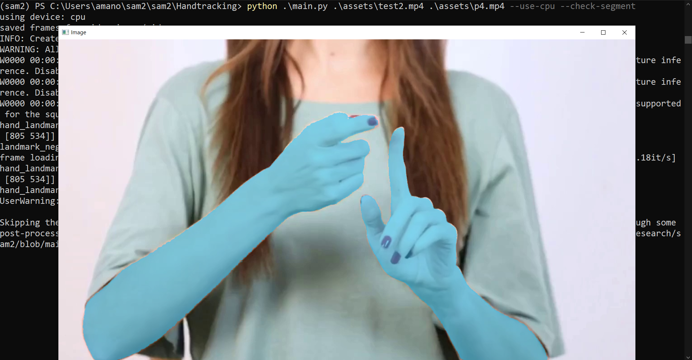

# HandTracking

Hand Tracking and Segmentation with Mediapipe and SAM2

## Working


## Setting up:

- Create a conda virtual environment and activate it.
- Install torch torchvision and torchaudio

```sh
  $ conda create -n sam2 python=3.12
  $ conda activate sam2
  $ pip3 install torch torchvision torchaudio --index-url https://download.pytorch.org/whl/cu118
```

- Install the requirements - open-cv, supervision, mediapipe

```sh
  $ pip install -r requirements.txt
```

## Running the script:

```sh
  $ python main.py [source_video_path] [target_video_path] --use-cpu --manual --check-landmark --check-segment
```

> flag --use-cpu will force the program to use the cpu. Omit this if you want to use the available resources of your system(like GPU)

## Example running the script :

```sh
  $ python main.py test.mp4 processed.mp4 --use-cpu
```

> Checkout the video folder for test.mp4 and processed.mp4

## Example input and output video


<hr>

# Updates

## Add flag --manual-mode
```sh
$ python main.py [source_video_path] [target_video_path] --manual
```


**Details:**
  1. User can use the manual mode to provide the input points for SAM2 model through GUI. Opens the first frame of the video in a new window
  2. The user can select positive landmark points using left-mouse-click
  3. The user can also select negative landmarks using Ctrl + left-mouse-click
  4. Keyboard press 'o' to submit the points in the image
  5. Keyboard press 'c' to clear the points in the image
  6. Keyboard press 'q' to exit the program

The green points are positive landmarks and the red ones are negative landmarks.

### Examples where manual-mode helps
1. When image is blur and cant fully detect hands in the image

Without manual-mode



With manual-mode




Without manual-mode



With manual-mode



## Add flag --check-landmark
```sh
$ python main.py [source_video_path] [target_video_path] --check-landmark
```


**Details:**
  1. Allows the user to check the output of hand-recognization done by Mediapipe on the first frame of the video
  2. Keyboard press 'o' to continue
  3. Keyboard press 'q' to exit the program
  4. Not available for manual mode(since you are yourself selecting the points)

## Add flag --check-segment
```sh
$ python main.py [source_video_path] [target_video_path] --check-segment
```


**Details:**
  1. Allows the user to check the output of segmentation by SAM2 on the first frame of the video
  2. Keyboard press 'o' to continue
  3. Keyboard press 'q' to exit the program
