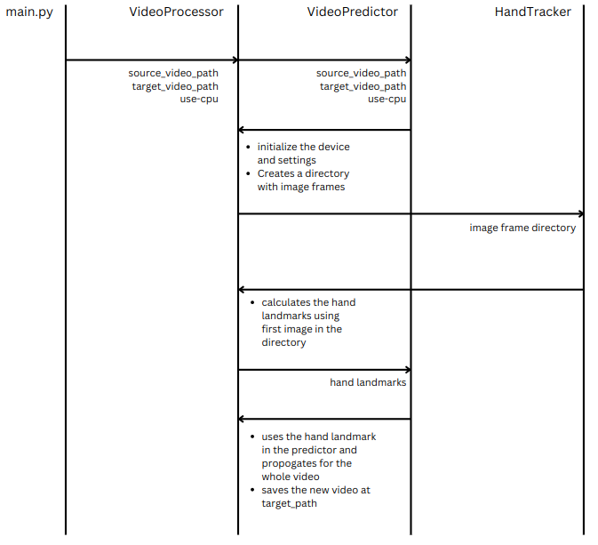

# HandTracking

Hand Tracking and Segmentation with Mediapipe and SAM2

## Working



## Setting up:

- Create a conda virtual environment and activate it.
- Install torch torchvision and torchaudio

```sh
  $ conda create -n sam2 python=3.12
  $ conda activate sam2
  $ pip3 install torch torchvision torchaudio --index-url https://download.pytorch.org/whl/cu118
```

- Install the requirements - open-cv, supervision, mediapipe

```sh
  $ pip install -r requirements.txt
```

## Running the script:

```sh
  $ python main.py [source_video_path] [target_video_path] --use-cpu
```

> flag --use-cpu will force the program to use the cpu. Omit this if you want to use the available resources of your system(like GPU)

## Example running the script :

```sh
  $ python main.py test.mp4 processed.mp4 --use-cpu
```

> Checkout the video folder for test.mp4 and processed.mp4

## Example input and output video


